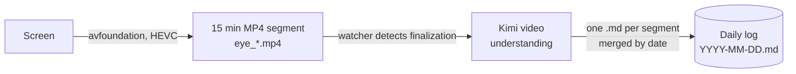

# visual-base

> The second brain from your eyes.

Most "second brain" tools leave the remembering to you. You write the
note, highlight the line, tag the page. Whatever you forget to capture
is gone, and what you do capture is a biased sample of what actually
happened that day.

`visual-base` just records what your eyes land on. Your screen,
continuously, as compressed video. That raw stream is the single
source of truth. If it was on your screen, it is in the recording.

On top of the video it writes an Obsidian style markdown log of what
you actually did. You read it to see where your day went. An agent
reads it to jump to the minute of footage it needs, which makes the
log less a diary and more an index into the video. Eventually we want
to let you RAG your own trajectory the same way you already RAG your
documents.

What ships:

- **`bub_eye`** is a background screen recorder for macOS on both
  Intel and Apple Silicon. It uses hardware HEVC through
  `avfoundation`, writes roughly 10 MB for every 15 minutes of
  footage, and uses almost no CPU.
- **`bub_kimi`** wires Kimi in as the default agent for video
  understanding and daily log generation.
- **`video-activity-log`** turns any segment into a daily log you can
  open in Obsidian. One bullet per activity, with `[[wikilinks]]` on
  every site, app, person, and project it can identify.

## How it works



The `.mp4` segments are the source of truth. The daily `.md` log is
derived from them, and you can always regenerate it by running the
understanding step again on the same segments.

## Install

```bash
uv tool install visual-base
uv tool install kimi-cli
```

The ffmpeg binary that `bub_eye` needs ships inside the wheel via
`imageio-ffmpeg`.

Authenticate Kimi once. You can log in through the TUI.

```bash
kimi login
```

Or set an API key through environment variables.

```bash
cp .env.example .env   # then fill in BUB_KIMI_*
```

macOS will ask for Screen Recording permission the first time
`bub_eye` spawns ffmpeg. The grant is tied to a specific binary path,
so you need to grant it again if you later point `BUB_EYE_FFMPEG` at
a system ffmpeg.

### For local development

```bash
uv sync
cp .env.example .env
uv run visual-base --help
```

## Run

```bash
uv tool run visual-base gateway
```

This starts the recorder and the Kimi chat channel together.
Everything lives under `$BUB_HOME`, which defaults to `~/.bub/`.

- Video segments live at
  `~/.bub/eye/segments/eye_YYYYMMDD_HHMMSS.mp4`.
- Daily activity logs live at `~/.bub/eye/logs/YYYY-MM-DD.md`.
