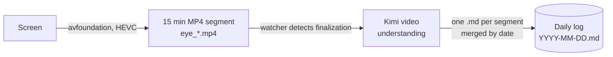

<div align="center">
  <h1>visual-base</h1>
  <p><b>The second brain from your eyes.</b></p>
  <a href="https://pypi.org/project/visual-base/"></a>
  <a href="https://github.com/oilbeater/visual-base/stargazers"></a>
  <a href="LICENSE"></a>
</div>

<br/>

## Why

Most "second brain" tools leave the remembering to you. You write the
note, highlight the line, tag the page. Whatever you forget to capture
is gone, and what you do capture is a biased sample of what actually
happened that day.

visual-base just records what your eyes land on. Your screen,
continuously, as compressed video. That raw stream is the single
source of truth. If it was on your screen, it is in the recording.

On top of the video it writes an Obsidian style markdown log of what
you actually did. You read it to see where your day went. An agent
reads it to jump to the minute of footage it needs, which makes the
log less a diary and more an index into the video. Eventually you
should be able to RAG your own trajectory the same way you already RAG
your documents.

## Parts

| Module | What it does |
| :--- | :--- |
| `bub_eye` | Background screen recorder for macOS on Intel and Apple Silicon. Hardware HEVC through avfoundation, roughly 10 MB per 15 minutes of footage, almost no CPU. |
| `bub_kimi` | Wires Kimi in as the default agent for video understanding and daily log generation. |
| `video-activity-log` | Turns any segment into a daily log you can open in Obsidian. One bullet per activity, with `[[wikilinks]]` on every site, app, person, and project it can identify. |

## How it works



The `.mp4` segments are the source of truth. The daily `.md` log is
derived from them, and you can always regenerate it by running the
understanding step again.

## Install

```bash
uv tool install visual-base
uv tool install kimi-cli
```

The ffmpeg binary that `bub_eye` needs ships inside the wheel via
`imageio-ffmpeg`.

Authenticate Kimi once, either through the TUI:

```bash
kimi login
```

or by setting an API key through environment variables:

```bash
cp .env.example .env   # then fill in BUB_KIMI_*
```

macOS asks for Screen Recording permission the first time `bub_eye`
spawns ffmpeg.

## Run

```bash
visual-base gateway
```

Starts the recorder and the Kimi chat channel together. Everything
lives under `$BUB_HOME`, which defaults to `~/.bub/`.

- Video segments: `~/.bub/eye/segments/eye_YYYYMMDD_HHMMSS.mp4`
- Daily activity logs: `~/.bub/eye/logs/YYYY-MM-DD.md`

## Development

```bash
uv sync
cp .env.example .env
uv run visual-base gateway 
```

## Uninstall

```bash
uv tool uninstall visual-base
uv tool uninstall kimi-cli
```

Recorded footage and generated logs stay under `$BUB_HOME`. Delete
that folder yourself if you want to reclaim the disk.

## Background

Every "second brain" tool asks you to notice something and write it
down. Choosing what to capture is also choosing what to lose. You
remember the line you highlighted and forget the paragraph right
before it you skimmed past.

Your eyes already saw everything. The missing piece is somewhere to
go back and ask.

visual-base is the smallest machinery that gets you there. A recorder
that does not drain your battery, a default agent that can watch an
hour of footage and tell you what happened, and a log format you can
read, grep, and eventually RAG.

## License

MIT. Use it, fork it, break it, improve it.
